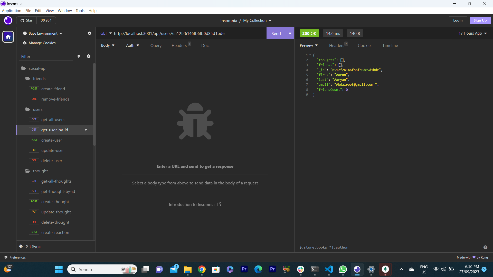
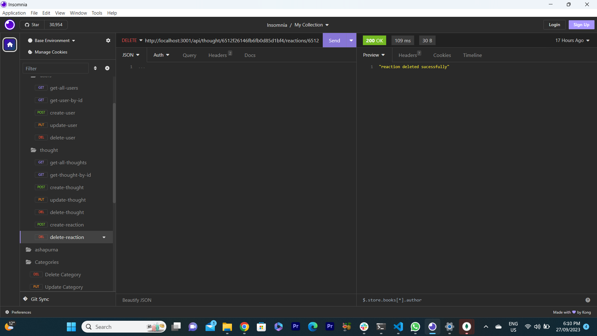

# Social-Network-API

# Description
This is a social Network API where users can create their thoughts ,update ,delete and even react to friend's thought .They can create their friend's list and even delete friend's list if they dont want.we have used MongoDB and we can add data by API (Insomnia Any software) and i have create seed file where data can add to database as a static

This project has been deployed to GitHub Pages. To get this project up and running, you can follow the deployment link. Or, download the sources files to use this as a template.

* [GitHub Repository](https://github.com/LipikaManglaa/Social-Network-API.git)
* [Deployed GitHub IO]  git@github.com:LipikaManglaa/Social-Network-API.git

# Walk Through video Link 

https://drive.google.com/file/d/13UvxRukrR55j_TrVbKKUVP-UR2IY35T1/view

video :https://drive.google.com/file/d/1H4HJAnuf5tn2KKxBtGKIhku2q5jFz_qe/view

## Table of Contents

  
* [Description](#Description)

* [Screenshots](#Screenshots) 

* [Technologies-Used](#Technologies-Used)

* [Features](#Features)   

* [Installation](#installation)
  
* [Instructions](#Instructions) 
          
* [Questions](#questions)
 
* [Usage](#usage)

* [License](#license)   

### Features

This is social network api where we have used no Sql database (Mongo DB) 

## API FOR User (create ,delete,update ,get all user details ,get user by id)

1) When API GET routes for  all users, the data for each of the routes is displayed in formatted JSON.
   http://localhost:3001/api/users/
 

 2) When API GET routes for  single users by ID, the data for each of the routes is displayed in formatted JSON.
 http://localhost:3001/api/users/:userID
 

  3) When API Post routes for  create users witha username and email(which is validated)
  http://localhost:3001/api/users/

 

4) When API delete routes by ID for  delete users 
http://localhost:3001/api/users/:userId

 

 # API FOR friend (create ,delete)
 1) When API post routes for  create friend
 http://localhost:3001/api/users/:userID/friends/:friendId

 

  2) When API Delete routes  for friend
  http://localhost:3001/api/users/:userID/friends/:friendId

 

 ## API FOR Thought (create ,delete,update ,get all user details ,get user by id)

1) When API GET routes for  all thoughts, the data for each of the routes is displayed in formatted JSON.

http://localhost:3001/api/thought
 

 2) When API GET routes for  single thoughts by ID, the data for each of the routes is displayed in formatted JSON.
 http://localhost:3001/api/thought/:thoughtID
 

  3) When API Post routes for  create thoughts with thoughttext,username,userID 
  http://localhost:3001/api/thought

 

4) When API update thought routes by ID for  
http://localhost:3001/api/thought/:thoughtID
 

 # Reaction routes

  3) When API Post routes for  create reactionss 
  http://localhost:3001/api/thought/:thoughtId/reactions

 

4) When API delete reaction routes 
http://localhost:3001/api/thought/:thoughtId/reactions/:reactionId

 

### Technologies-Used
  * Express.js
  * Node.js
  * MongoDB
  * Mongoose
  * Insomnia
  * Date.js

### Installing

* To install this code, download the zip file, or use GitHub's guidelines to clone the repository. 

* Node.js and MongoDB is required to run the application

* To install dependiencs,run command npm i

## Usage
This project usage is for anyone that who want to create Socail network which one needs for create thoughts ,their reaction and create friend list and if they want they can delete as well

## Instructions
If you would like to see how to create Social Network API then you can check my github repo and let you know  how to cretae it

## License
This application is covered under the MIT license

## Questions
Created by: LipikaManglaa

If you have any further questions please feel free to contact me at lipika.mangla.web@gmail.com